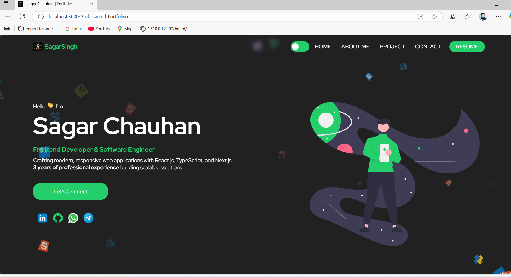
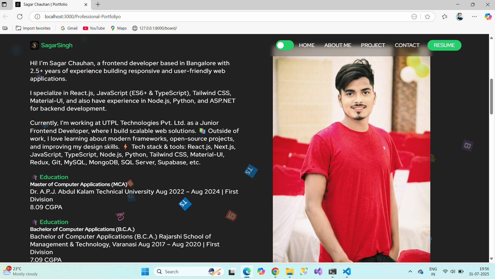

# Professional Portfolio

My live portfolio is hosted here 👉 [View Portfolio](https://sagarvns.github.io/Professional-Portfoliyo/)

This project is built using **React.js** and deployed on **GitHub Pages**.

## 📸 Screenshot

 
This project was created with CRA (Create React App)

This is my portfolio website to introduce myself, here I put my skills, projects, and contact details.

## Technologies used:
- React
- Typescript
- Styled Components
 
## To run this project:
- yarn install
- yarn run start
